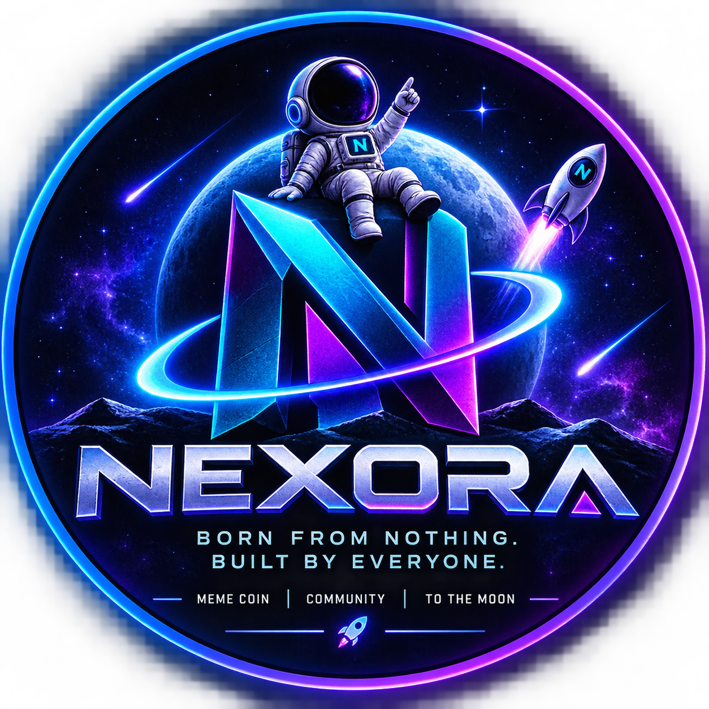

<!DOCTYPE html>
<html lang="en">
<head>
<meta charset="UTF-8">
<meta name="viewport" content="width=device-width, initial-scale=1.0">

<title>NEXORA ($NEXO) — Born From Nothing</title>

<meta name="description"
content="NEXORA ($NEXO) — Born From Nothing. Built By Everyone. A community-driven meme coin on Solana.">

</head>

<body>

<!-- NAVIGATION -->
<nav>

NEXORA

<a href="#about">About</a>
<a href="#tokenomics">Tokenomics</a>
<a href="#roadmap">Roadmap</a>
<a href="#community">Community</a>

</nav>

<!-- HERO -->
<section class="hero">

SOLANA COMMUNITY MEME COIN

<h1>
NEXORA
</h1>

Born From Nothing. 
Built By Everyone.

A community-driven meme movement on Solana.
 
No promises. Just memes, community and ambition.

<a class="btn primary" href="#tokenomics">
EXPLORE $NEXO
</a>

<a class="btn" href="#community">
JOIN COMMUNITY
</a>

</section>

<!-- ABOUT -->
<section id="about">

<h2>What is NEXORA?</h2>

The meme starts here.

<h3>🌌 Community</h3>

NEXORA is built around its community.
Everyone can become part of the movement.

<h3>🚀 Solana</h3>

NEXORA is designed around the fast and low-cost
Solana ecosystem.

<h3>🔥 Meme Culture</h3>

Memes, creativity and community are the heart
of NEXORA.

</section>

<!-- TOKENOMICS -->
<section id="tokenomics">

<h2>Tokenomics</h2>

Simple. Transparent. Community focused.

<h3>Total Supply</h3>

1,000,000,000

$NEXO

<h3>Liquidity</h3>

60%

Planned allocation

<h3>Community</h3>

15%

Airdrops & rewards

<h3>Marketing</h3>

10%

Community growth

<h3>Development</h3>

5%

Project development

<h3>Reserve</h3>

10%

Future ecosystem needs

</section>

<!-- CONTRACT -->
<section>

<h2>Contract</h2>

Official $NEXO contract information.

<strong>COMING SOON</strong>

  

Official Solana contract address will be published
after token deployment.

</section>

<!-- ROADMAP -->
<section id="roadmap">

<h2>Roadmap</h2>

From zero to NEXORA.

<h3>PHASE 01 — GENESIS</h3>

Brand creation, website launch, community setup
and social media presence.

<h3>PHASE 02 — LAUNCH</h3>

Token deployment, liquidity setup and
initial community distribution.

<h3>PHASE 03 — EXPANSION</h3>

Community campaigns, partnerships,
creator collaborations and ecosystem growth.

<h3>PHASE 04 — NEXORA</h3>

Build a recognizable meme community
and continue developing the ecosystem.

</section>

<!-- COMMUNITY -->
<section id="community">

<h2>Join NEXORA</h2>

Be part of the beginning.

<!-- এখানে তোমার আসল X link বসাবে -->
<a href="#" target="_blank">𝕏 X / Twitter</a>

<!-- এখানে Telegram link বসাবে -->
<a href="#" target="_blank">✈ Telegram</a>

<!-- এখানে Discord link বসাবে -->
<a href="#" target="_blank">💬 Discord</a>

<a class="btn primary" href="#">
JOIN THE MOVEMENT
</a>

</section>

<!-- FOOTER -->
<footer>

© 2026 NEXORA. All rights reserved.

NEXORA is a meme/community project.
Nothing on this website constitutes financial advice.

</footer>

</body>
</html>
